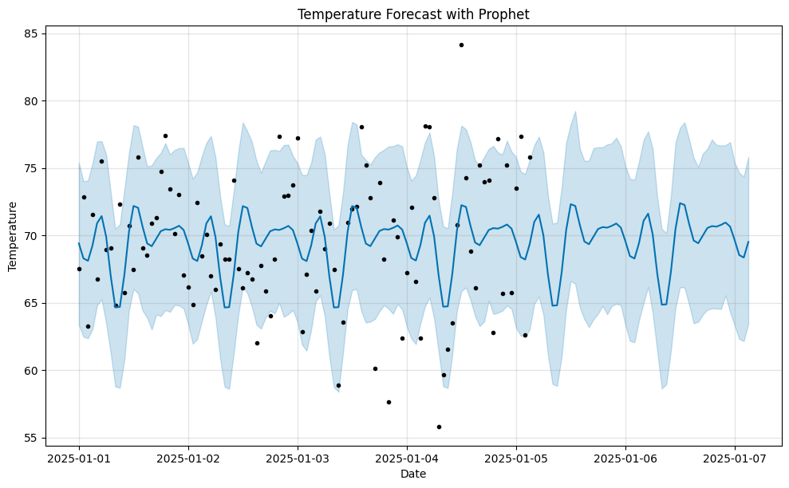
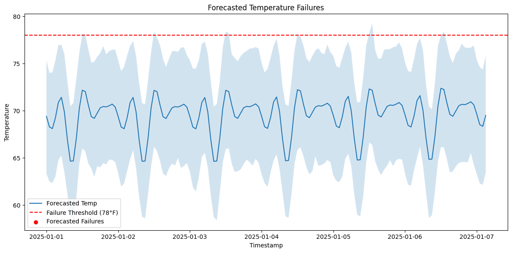

# Prophet Failure Forecast – Predictive Maintenance with Time Series

This project uses [Facebook Prophet](https://facebook.github.io/prophet/) to forecast temperature sensor data and predict when equipment is likely to **fail in the future**.

It builds upon my earlier project on anomaly detection by taking a **proactive, forecast-driven approach** to smart automation.

Based on my technical blog:  
[Forecasting Equipment Failures Using Prophet](https://medium.com/@myakalarajkumar1998)

---

## 🚀 Objective

To simulate sensor temperature data and apply **time-series forecasting** to predict when temperature values will cross a critical failure threshold (78°F) — enabling early intervention in predictive maintenance systems.

---

## 🧠 Tech Stack

- Python 3.x  
- Facebook Prophet  
- pandas, matplotlib  
- Jupyter Notebook  
- Simulated sensor dataset

---

## 📊 Output Snapshots

### Temperature Forecast (Prophet)


### Forecasted Failure Points


---

## 📌 How to Run

```bash
# Clone and set up environment
git clone https://github.com/rajkumar160798/prophet-failure-forecast.git
cd prophet-failure-forecast
python3 -m venv venv
source venv/bin/activate
pip install -r requirements.txt

# Run Jupyter
jupyter notebook
```
---
## 👨‍💻 Author
**Raj Kumar Myakala**  
AI | Data | Automation | ML 
[LinkedIn ](https://www.linkedin.com/in/raj-kumar-myakala-927860264/)  
[GitHub ](https://github.com/rajkumar160798)

---

> ⭐ If you like this project, consider starring the repo and following my GitHub for more AI/ML innovations!